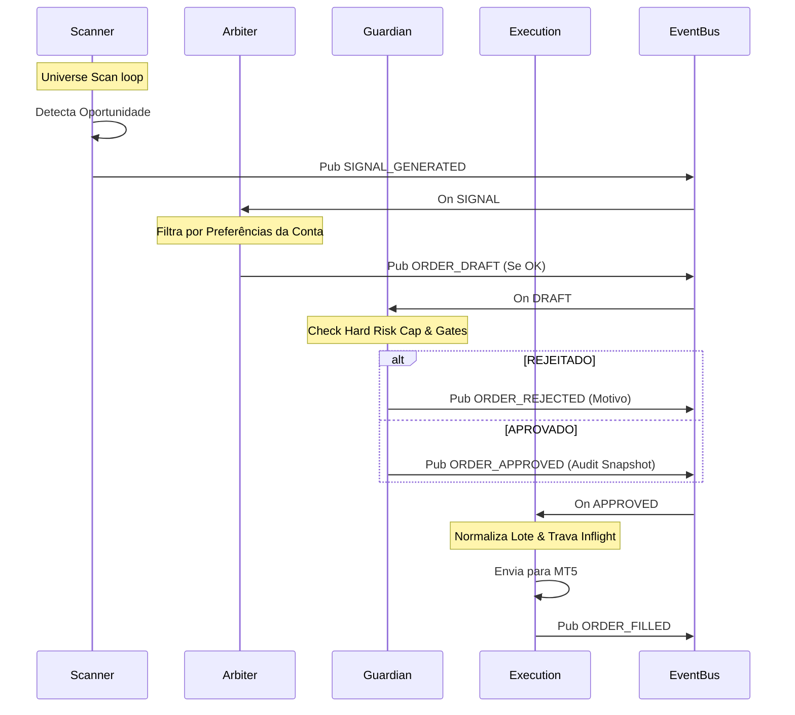
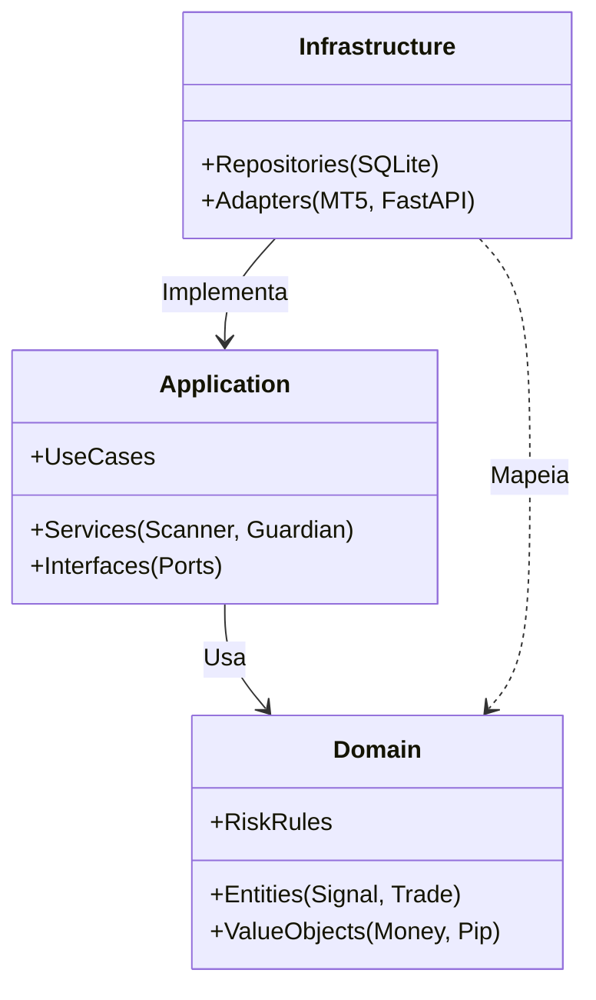

# RL TRADER — V3 BASE PROTOCOL (CHASSIS)
**Versão:** 0.1 (Draft)
**Escopo:** Infra + Arquitetura Base + Auditoria + Risco + Diagramação

## 1. Visão Geral
Este projeto estabelece o "Chassis" profissional para o RL Trader V3. O design é focado em **Safety First** e **Auditabilidade Total**.

### Princípios
1.  **Safety First:** Nenhuma ordem é enviada sem aprovação explícita do Guardian.
2.  **Transparência Radical:** Tudo é visível no Dashboard via WebSocket.
3.  **Auditabilidade:** Cada decisão (entrada, saída, rejeição) é persistida em log estruturado.
4.  **Clean Architecture:** Separação estrita entre Domínio, Aplicação e Infraestrutura.

---

## 2. Diagramas de Arquitetura (Mermaid)

### 2.1 Visão de Containers (C4)
```mermaid
flowchart LR
    subgraph Client [Cliente]
        Browser[Browser Dashboard React]
    end

    subgraph VPS [Windows VPS (Single Node)]
        direction TB
        
        API[API Gateway (FastAPI)]
        EventBus(Event Bus / SQLite)
        
        subgraph Engine [Trading Engine]
            Scanner[Scanner Service]
            Arbiter[Arbiter Service]
            Guardian[Guardian Service]
            Execution[Execution Service]
            Watchdog[Watchdog]
        end
        
        MT5[MetaTrader 5 Terminal]
    end

    Browser <-->|WebSocket/REST| API
    API <--> EventBus
    Engine <--> EventBus
    Execution <-->|PyMT5| MT5
    MT5 <-->|Internet| Broker
```

### 2.2 Fluxo de Decisão (Pipeline de Compra)


### 2.3 Camadas de Software (Clean Arch)


---

## 3. Componentes do Sistema

### 3.1 Core Services (Engine)
1.  **ScannerService**: Monitora o mercado e gera sinais técnicos. Não decide trade.
2.  **ArbiterService**: "Engine de Decisão". Combina sinal técnico com perfil do usuário.
3.  **GuardianService**: "Risco Central". Calcula perda máxima monetária e aprova/rejeita.
4.  **ExecutionService**: Executor burro e seguro. Garante idempotência e travas.
5.  **Watchdog**: Monitora saúde dos processos e reinicia se necessário.

### 3.2 Infraestrutura
*   **EventStore (SQLite)**: Persistência de todos os eventos para auditoria.
*   **API Gateway**: Exposição REST e WebSocket para o Frontend.
*   **Settings Manager**: Gerenciamento de configuração centralizado e auditável.

## 4. Gerenciamento de Risco (Guardian)
O V3 implementa **Hard Risk Cap**:
*   Risco calculado monetariamente (ex: €50 de perda máxima).
*   Se `(Entrada - SL) * Volume * TickValue > MaxRisk`, o trade é rejeitado ou o lote reduzido.
*   Snapshot de auditoria salvo com cada aprovação.

## 5. Próximos Passos (Implementação)
1.  Definir Modelos de Domínio (`src/domain`).
2.  Implementar EventBus e Logging (`src/infrastructure`).
3.  Implementar Serviços básicos (`src/application`).
4.  Conectar API (`src/interface`).
