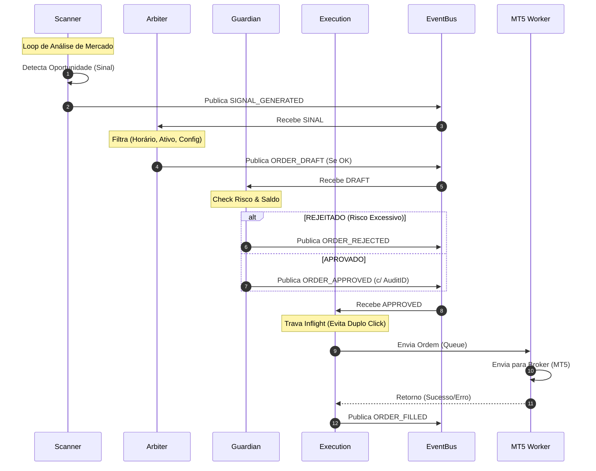
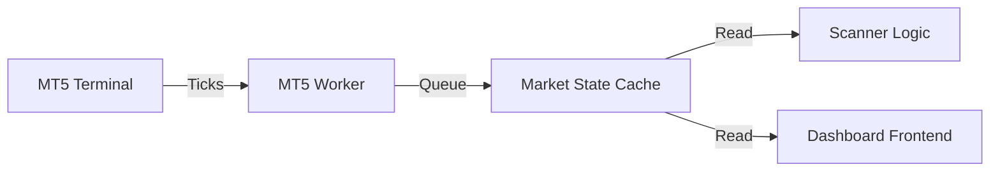

# 2. Fluxos Críticos do Sistema

Esta seção detalha como a informação flui dentro do **RL Trader V3**, desde a detecção de uma oportunidade de mercado até a confirmação de execução da ordem.

## Pipeline de Trading (O Caminho da Ordem)

O sistema segue um fluxo linear e auditável para cada decisão de trading. Nada acontece "mágicamente"; cada passo é um evento registrado.

### Etapas do Pipeline

1.  **Sinalização (Scanner):** O Scanner analisa o mercado (Ticks/Candles) e emite um evento `SIGNAL_GENERATED` se encontrar uma configuração técnica válida (ex: Cruzamento de médias).
2.  **Arbitragem (Arbiter):** O Arbiter recebe o sinal e verifica se ele se alinha com as configurações do robô (ex: Horário permitido, Pares permitidos). Se aprovado, emite `ORDER_DRAFT`.
3.  **Guardião (Guardian):** O "Risco Central". Calcula o impacto financeiro do trade.
    *   Verifica saldo, margem e exposição atual.
    *   Calcula o lote baseado no risco monetário (ex: Max €50 loss).
    *   Se aprovado, emite `ORDER_APPROVED` com um snapshot de auditoria.
4.  **Execução (Executor):** Recebe a ordem aprovada e a envia para o Worker do MT5. Garante que a ordem não seja duplicada (Idempotência).

---

## Diagrama de Sequência (Fluxo de Compra)

## Fluxo de Dados (Data Ingestion)

Para que o Scanner funcione, ele precisa de dados atualizados. O fluxo de dados é otimizado para não sobrecarregar o MT5.

1.  **Tick Data:** O MT5 Worker envia ticks em tempo real via fila de alta velocidade.
2.  **Candles (Histórico):** Solicitados sob demanda ou em batch na inicialização.
3.  **Cache:** O Python mantém uma cópia local do estado do mercado (Market Snapshot) para que o Scanner não precise consultar o MT5 a cada milissegundo.

### Atualização de Estado

