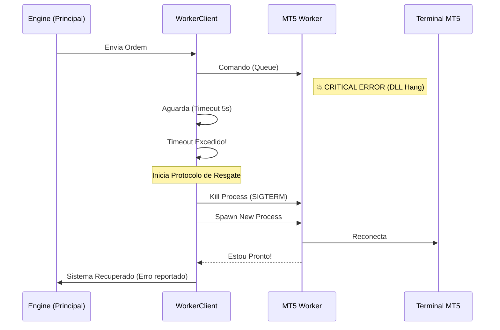

# 3. Blindagem e Isolamento do MT5

O maior ponto de falha em robôs de trading algorítmico baseados em MetaTrader 5 é a biblioteca `MetaTrader5` (Python package), que é um wrapper C++. Se ela travar, o processo Python inteiro morre.

O **RL Trader V3** resolve isso com uma arquitetura de **Isolamento de Processo**.

## O Problema das DLLs
- A biblioteca MT5 interage diretamente com a memória do terminal.
- Travamentos de rede ou erros internos na DLL podem causar `Segmentation Fault`.
- Em uma arquitetura monolítica, isso derruba o robô e deixa posições abertas sem monitoramento.

## A Solução: Process Isolation Architecture

O V3 separa o sistema em dois processos distintos:

1.  **V3 Engine (Principal):** Contém toda a lógica, IA e conexão com o Frontend. É 100% Python puro e estável.
2.  **MT5 Worker (Satélite):** Um processo descartável que faz apenas uma coisa: falar com o MT5.

Se o Worker travar, o Engine detecta, mata o processo morto e sobe um novo em milissegundos.

### Mecanismo de Recuperação (Watchdog)

O sistema possui um **Watchdog Proativo** que monitora a saúde do Worker.

1.  **Heartbeat:** O Worker envia um sinal de vida a cada segundo.
2.  **Timeout:** Se o Worker não responder a um comando (ex: `order_send`) em 10 segundos, ele é considerado "zumbi".
3.  **Kill & Restart:** O Engine termina forçadamente o processo do Worker e inicia um novo.
4.  **Reconciliação:** O novo Worker lê o estado real do MT5 e sincroniza com o Engine.

---

## Diagrama de Recuperação de Falhas

Este diagrama ilustra o que acontece quando o MT5 trava.

## Benefícios da Blindagem
1.  **Zero Downtime:** O robô nunca para, mesmo que o MT5 reinicie.
2.  **Proteção de Capital:** O risco é gerenciado pelo Engine, que nunca perde a consciência do estado.
3.  **Auditabilidade:** Cada reinicialização é registrada como um evento crítico.
