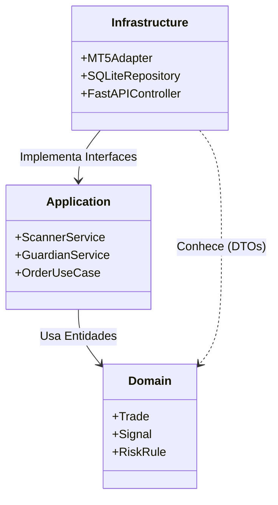

# 4. Estrutura de Código e Organização

O **RL Trader V3** adota a **Clean Architecture** (Arquitetura Limpa) para garantir que o código seja testável, manutenível e escalável. O princípio central é que **dependências apontam para dentro**:
- A Infraestrutura depende da Aplicação.
- A Aplicação depende do Domínio.
- O Domínio não depende de ninguém.

## Mapa de Diretórios (`src/`)

Abaixo, a estrutura de pastas explicada:

### `src/domain` (O Coração)
Regras de negócio puras. Não sabe o que é banco de dados, nem MT5, nem API.
*   **Entities:** Objetos com identidade (ex: `Order`, `Trade`, `Signal`).
*   **Value Objects:** Objetos definidos por seus atributos (ex: `Money`, `Pip`, `Timeframe`).
*   **Risk Rules:** Lógica matemática de risco (ex: cálculo de Drawdown).

### `src/application` (Os Casos de Uso)
Orquestra o fluxo de dados entre o Domínio e o mundo externo.
*   **Services:** Implementam a lógica de aplicação.
    *   `ScannerService`: Coordena a busca por sinais.
    *   `ArbiterService`: Aplica filtros de usuário sobre os sinais.
    *   `GuardianService`: Verifica regras de risco antes da execução.
*   **Interfaces:** Contratos (Protocolos) que a infraestrutura deve implementar.

### `src/infrastructure` (O Mundo Real)
Detalhes técnicos. Aqui vivem as bibliotecas externas e implementações concretas.
*   **Adapters:** Conectores para serviços externos.
    *   `MT5Adapter`: Implementação concreta da comunicação com o MetaTrader.
*   **Repositories:** Acesso a dados (SQLite, Arquivos).
    *   `EventStoreRepository`: Salva eventos no banco.

### `src/interface` (A Porta de Entrada)
Como o mundo fala com o robô.
*   **API (FastAPI):** Define as rotas HTTP e WebSocket.
*   **DTOs:** Modelos de dados para entrada e saída da API.

---

## Diagrama de Dependências

## Guia de Desenvolvimento
- **Nova Regra de Negócio?** Adicione em `src/domain`.
- **Novo Fluxo (ex: Trailing Stop)?** Crie um Service em `src/application`.
- **Mudou o Banco de Dados?** Altere apenas `src/infrastructure`.
- **Novo Endpoint na API?** Adicione em `src/interface`.
