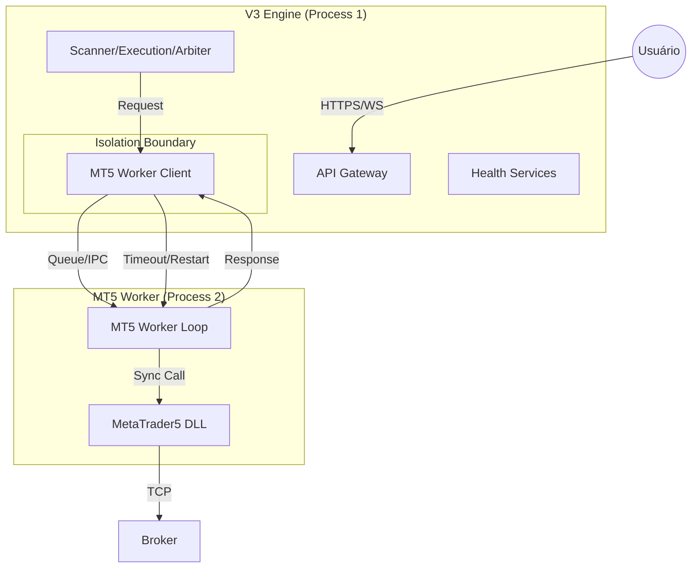
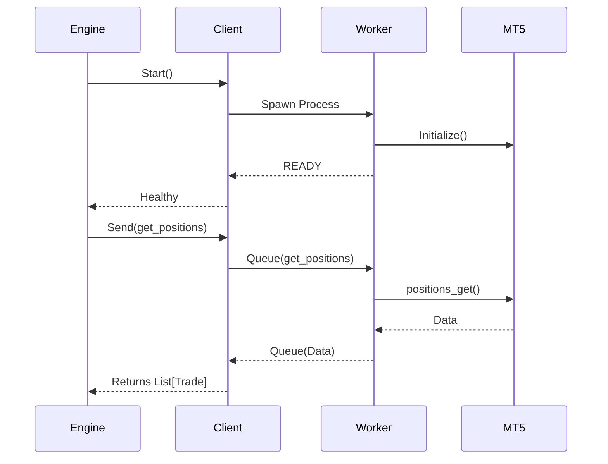
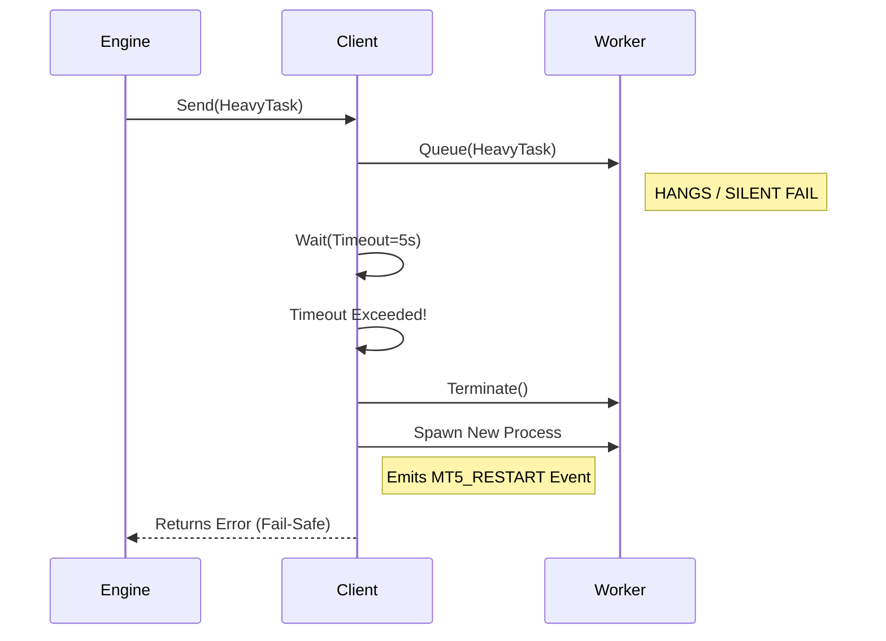

# RL TRADER — V3 BASE PROTOCOL (HARDENED CHASSIS)

**Versão:** 0.7 (MT5 Audit & Hardening)  
**Ambiente:** Windows VPS (MT5 + Python 3.11+)  
**Filosofia:** Safety First, Radical Transparency, Fail-Safe Architecture

## 1. Visão Geral da Arquitetura

O V3 Chassis foi projetado para operar 24/7 com máxima resiliência. A versão 0.6 introduz o **Isolamento de Processo MT5** para eliminar travamentos silenciosos da DLL.

### Diagrama de Containers (C4)


---

## 2. Protocolos de Resiliência (Hardening)

### A) MT5 Process Isolation (Blindagem Máxima)
- **Problema:** A lib `MetaTrader5` (C-extension) pode travar (hang) silenciosamente ou quebrar (segfault), derrubando todo o robô.
- **Solução:** O MT5 roda em um processo separado (`mt5_worker.py`).
- **Mecanismo:** O `Core` envia comandos via fila. Se o `Worker` não responder em X segundos (Timeout), o `Client` mata o processo e inicia um novo imediatamente.
- **Benefício:** O Robô nunca morre por culpa do MT5.

### B) Reconciliação de Estado (Crash Recovery)
Ao iniciar (ou reiniciar o Worker), o sistema ajusta a realidade:
1. **Verdade:** O Terminal MT5 (`positions_get`).
2. **Memória:** O SQLite (`trades` table).
3. **Ação:** O `Reconciler` compara e sincroniza.

### C) Proteção Temporal (Time Skew Guard)
- **Checagem:** A cada 10s.
- **Limite:** 30s de diferença entre Server e Local.
- **Ação:** Pause Scanner + Alerta CRITICAL.

---

## 3. Riscos e Garantias (Audit Block)

### 3.1 Idempotência de Ordens
Para evitar duplicação em caso de restart ou timeout (rede instável):
- Todo comando de execução carrega um `intent_id` (UUID).
- Esse ID é anexado ao **comentário da ordem** no MT5: `MyStrategy [a1b2c3d4]`.
- Antes de enviar nova ordem, o sistema verifica se já existe posição aberta com esse ID.

### 3.2 timeouts por Método
O `WorkerClient` impõe prazos rígidos para evitar travamentos:
- `get_history`: 30s (Dados Pesados)
- `order_send`: 10s (Latência de Rede)
- `get_positions`: 5s (Tick Rápido)
- **Ação:** Se exceder, o Worker é reiniciado imediatamente.

### 3.3 Circuit Breaker (Anti-Flapping)
Se o MT5 reiniciar mais de **5 vezes em 5 minutos**:
1. O sistema entra em modo **CIRCUIT OPEN**.
2. Novas tentativas de conexão são bloqueadas.
3. Alerta **CRITICAL** é disparado.
4. O robô impede novas entradas até intervenção humana.

### 3.4 Segurança de DLL
- A biblioteca `MetaTrader5` é importada **apenas** dentro do processo `mt5_worker.py`.
- O processo principal é Python puro, livre de riscos de memória C++.

---

## 4. Fluxos Operacionais

### 4.1 Startup Sequence


### 4.2 Timeout & Recovery


---

## 5. Instruções de Deploy

### Configuração (.env)
```ini
MT5_LOGIN=...
MT5_PASSWORD=...
MT5_SERVER=...
MT5_WORKER_TIMEOUT=5.0
```

### Verificação (/health)
O endpoint de saúde monitora:
- `components.mt5.pid`: PID do worker atual.
- `components.mt5.restarts`: Contador de reinicializações.
- `components.mt5.circuit`: Status (CLOSED/OPEN).
