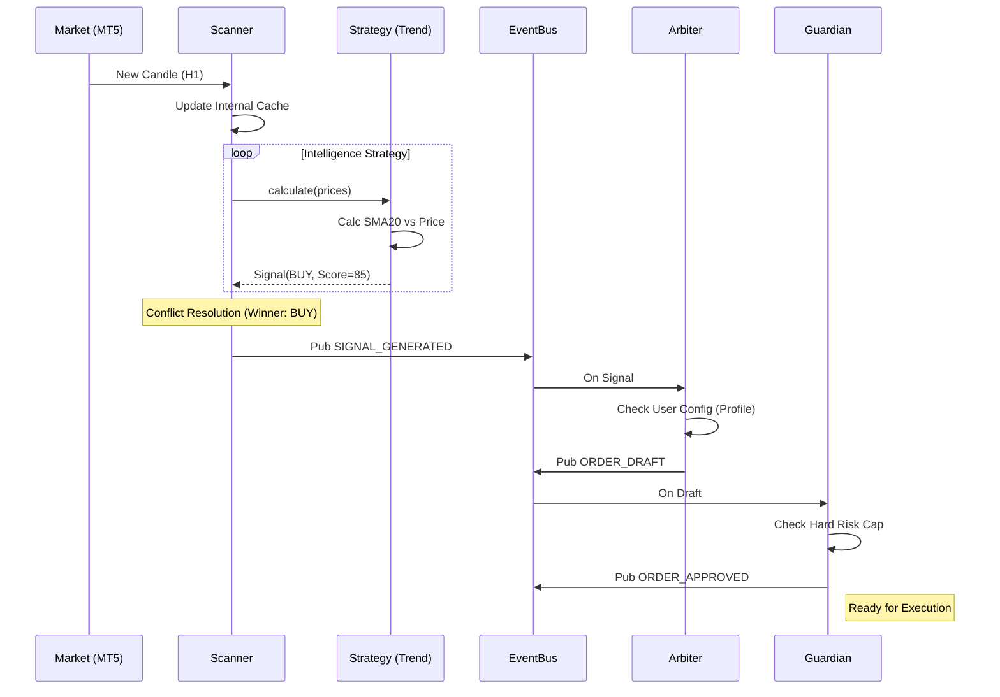
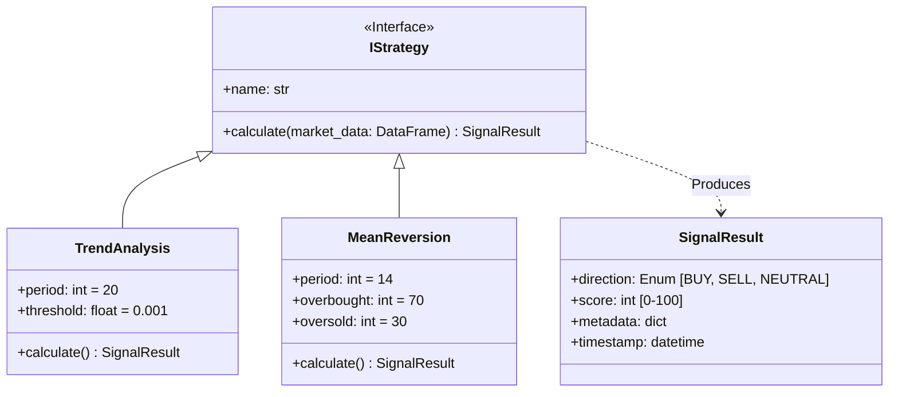

# Diagramas: Strategy Plan V3

Este documento contém os diagramas técnicos de suporte ao plano da camada de estratégias.

## 1. Flowchart: Fluxo de Dados e Decisão

Como a informação viaja desde a chegada do preço até a execução.

```mermaid
flowchart TD
    Tick[Market Data (Tick/Candle)] --> Scanner
    
    subgraph Intelligence Layer
        Scanner -->|Loop| StrategyA[Trend Strategy]
        Scanner -->|Loop| StrategyB[RSI Strategy]
        StrategyA -->|Score & Dir| Aggregator[Conflict Solver]
        StrategyB -->|Score & Dir| Aggregator
    end
    
    Aggregator -->|Winning Signal| EventBus((Event Bus))
    
    EventBus -->|SIGNAL_GENERATED| Arbiter[Arbiter Service]
    
    subgraph Decision Layer
        Arbiter -->|Check Preferences| Draft{Is Valid?}
        Draft -- Yes --> Guardian[Guardian Service]
        Draft -- No --> Ignore[Log & Ignore]
        
        Guardian -->|Check Risk| Approved{Safe?}
        Approved -- Yes --> Execution[Execution Service]
        Approved -- No --> Reject[Log Rejection]
    end
    
    Execution -->|Draft -> Order| MT5[MT5 Adapter]
```

## 2. Sequence Diagram: Ciclo de Vida do Sinal

O passo-a-passo temporal de um sinal de sucesso.



## 3. Class Diagram: Contrato de Estratégia

A estrutura das classes Python planejadas.


